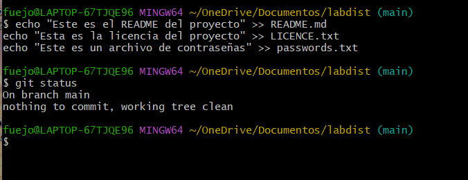
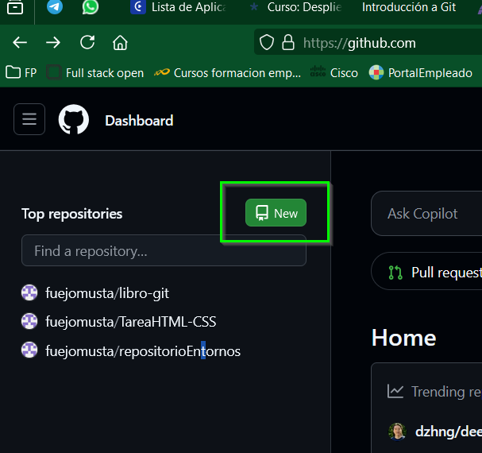
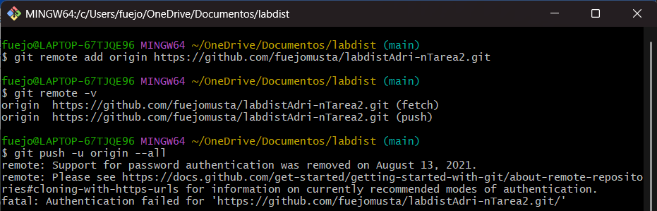

# Tarea2 - Ejercicio de Git - proyecto labdist


> Adrián García de la Cera
>
> 
>
> Enlace repositorio GitHub:
>
> https://github.com/fuejomusta/labdistAdri-nTarea2.git
>
> Enlace video presentación:
>
> https://www.loom.com/share/07734b26afe841fc8cc2e84d1e264ed7?sid=a1312d26-b874-4a0c-9968-9019e19bfd59

[TOC]


## Requisitos previos

- [ ] Tener cuenta de GitHub
- [ ] Tener instalado Sourcetree


## Trabajo en local

Al trabajar en local, creo la carpeta `labdist` con el entorno grafico, realizo clic derecho sobre ella y selecciono `Open Git Bash here` (para crear la carpeta a través de comandos usaríamos el comando `mkdir labdist`).


Una vez abierto, nos abre la consola de comandos de Git, introducimos el comando `git config --global merge.ff false` para que el historial de ramas se mantenga como árbol.


### 1.Inicializa un nuevo repositorio Git en una carpeta llamada `"labdist"` y agrega los archivos proporcionados en el aula virtual. Renombra la rama master a `main` , si es necesario. Realiza el primer `commit`. Muestra el log del repositorio.

Para inicializar el repositorio en la carpeta usamos el comando:

```
git init
```


Una vez iniciado copiamos en la carpeta los archivos del aula virtual.


Con el comando `git status` vemos los comandos que ya detecta los archivos introducidos.


Renombramos la rama master a main con el comando:  

```
git branch -m master main
```


Usamos el comando `git add .` para guardar los cambios en el área de preparación y con `git status` comprobamos que están subidos.


Una vez en el área de preparación, se realiza el `commit` al que nombraremos "Copiados archivos en labdist": 

```
git commit -m "Copiados archivos en labdist"
```


Mostramos los log del repositorio con `git log` o con `git log --oneline` para que lo muestre solo en una línea.

```
git log --oneline
```


### 2.Incluye un fichero `.gitignore` para que los ficheros `README.md` , `LICENCE.txt` y `passwords.txt` sean ignorados por el control de versiones. Realiza el commit y muestra los logs del repositorio en una línea.

Para que Git ignore los archivos indicados, en la raíz del repositorio creamos el archivo `.gitignore` de la siguiente manera: 

```
touch .gitignore
```


Utilizo el comando `nano .gitignore` para acceder al archivo `.gitignore` e indicarle el nombre de los archivos a ignorar, también es posible abrirlo haciendo doble clic y que se abra en un IDE como Visual estudio.


Subimos los cambios realizados al área de preparación y realizamos el `commit` con su nombre:

```
git commit -m "Añadido .gitignore para README.md , LICENCE.txt y passwords.txt"
```

Tras realizar el commit, se muestran los log con el comando: 

```
git log --oneline
```


### 3.En el repositorio, crea los archivos `README.md` , `LICENCE.txt` y `passwords.txt` con algún contenido. Muestra el estado del repositorio. Muestra el listado de archivos ignorados.

Para crear los archivos usamos el comando `touch` seguido por el nombre del archivo(por error se ha creado el fichero readmi en vez de readme, el fichero incorrecto se ha eliminado posteriormente).


Les añadimos contenido y para mostrar el estado del repositorio usamos el comando `git status` y observamos que al estar incluidos en el fichero .gitignore no aparecen.

```
echo "Este es el README del proyecto" >> README.md
echo "Esta es la licencia del proyecto" >> LICENCE.txt
echo "Este es un archivo de contraseñas" >> passwords.txt
```



Para ver el estado de los archivos ignorados usamos el comando:

```
git status --ignored
```


Aunque el ejercicio no lo pide, se utilizará `git add.` para guardar los cambios en el área de preparación y se realizara un commit.

```git
git add .
git commit -m "Añadido archivos README.md , LICENCE.txt y passwords.txt"
```


### 4.Crea una rama `feature-estilos` . Cámbiate a ella.
-Modifica el archivo `estilos.css` :
	-propiedad color del `body` y de `h2` : `#2a2a2a`
	-propiedad `background-color` de `header` y `footer`: `#2a75ff`
-Comprueba el estado del repositorio. Añade los cambios, realiza un commit con el mensaje "actualizados estilos a azules"

Para crear la rama usamos el comando `git branch`, usamos `git branch -av` para mostrar las ramas del repositorio.

```
git branch feature-estilos
git branch -av
```


Para cambiarme de rama usamos el comando:

```
git checkout feature-estilos
```


Para modificar la hoja de estilos.css se ha utilizado el IDE Visual Estudio:


Una vez modificada la hoja de estilos comprobamos el estado de estado del repositorio, añadimos los cambios al área de preparación y realizamos el commit.

```
git status
git add .
git commit -m "actualizados estilos a azules"
```


### 5.Vuelve a la rama `main` . En el archivo `index.html` añade un comentario donde se indique tu nombre como autor de la página. Comprueba el estado del repositorio. Añade los cambios, realiza un commit con el mensaje ' añadido autor en index'. Muestra los logs del repositorio en una línea, gráficamente y con 'decoración'

Para volver a la rama `main` usamos:

```
git checkout main
```

Luego con Visual Estudio Code se añade el comentario indicando el autor:


Una vez guardado la modificación en Visual Estudio Code, comprobamos el estado del repositorio con `git status`, añadimos los cambios al área de preparación y realizamos el commit con el nombre indicado.

```
git status
git add .
git commit -m "añadido autor en index"
```


Procedemos a mostrar los log en línea, gráficamente y decoración:

```
git log --graph --oneline --all --decorate
```


### 6.Fusiona la rama `feature-estilos` en la rama `main` . Muestra los logs del repositorio en una línea, gráficamente y con 'decoración'

Para fusionar la rama `feature-estilos` y `main` se utiliza el comando `git merge`, al realizar la fusión de ramas se realiza automáticamente un commit, como al realizar commit se le debe dar un nombre, al lanzar el comando nos abrirá el editor de texto y nos indicará un nombre por defecto, el cual podemos dejar o modificar.

```
git merge feature-estilos
```


Una vez realizado mostramos los log con el comando:

```
git log --graph --oneline --all --decorate
```


## Trabajo en remoto

### 1.Continúa con el repositorio `labdist` . Añade el repositorio a Sourcetree.

Para añadir el repositorio `labdist` a Sourcetree una vez abierto el programa, seleccionamos add, despues en browse buscamos nuestro repositorio, lo seleccionamos y pulsamos el botón Add.


### 2.En tu cuenta de GitHub, crea un repositorio remoto y sube al remoto los ficheros de tu repositorio local. Debes subir todas las ramas. Muestra, además, la captura de pantalla donde se vean en GitHub.

Para crear el repositorio, accedemos a nuestra cuenta GitHub, y seleccionamos el botón New que se encuentra el parte izquierda de la pantalla.



Una vez dado a new, debemos completar unos campos como su nombre (labdistAdriánTarea2), añadimos una pequeña descripción, nos aseguramos sea publico para la tarea.


Una vez creado el repositorio procedemos a subir las ramas del repositorio local a GitHub, para ello debemos enlazar el repositorio local con el remoto con `git remote add origin`, con `git remote -v` verificamos que se ha agregado correctamente y para subir todas la ramas se usa `git push -u origin --all`, en mi caso me ha dado error pues la autentificación no era la recomendad por lo que he creado un token en GitHub para poder dar acceso

```
git remote add origin https://github.com/fuejomusta/labdistAdri-nTarea2.git
git remote -v
git push -u origin --all
```




Una vez realizado, comprobamos en la web que se han subido los archivos del repositorio y sus ramas.


** Esta parte se ha realizado en consola de Git Bash por error, para realizarlo desde SourceTree habría que seguir los siguientes pasos:

1. Seleccionar Settings
2. En pestaña remotos
3. Pulsar botón add
4. En nombre ponerle el nombre del repositorio y en URL añadir el link de enlace de GitHub


### 3.En el repositorio local, crea una rama `feature-index` . Añade el siguiente código dentro de la `<section class="about">` . Añade los cambios y crea un commit con el mensaje "Añadido párrafo equipo en index.html". Sube los cambios al remoto. (Recuerda que debes usar SourceTree en todo este apartado)

Para crear la rama desde Sourcetree, hacemos clic en el botón branch, nos abrirá una ventana en la que indicamos el nombre de la rama y hacemos clic en el botón Create Branch


Una vez creada la rama, asegurándonos de estar en dicha rama, hacemos clic en el botón explorer de Sourcetree, nos abrirá un exploraro de archivos en los que vemos solo los archivos desde los que podemos acceder desde dicha rama, y modificamos el archivo `index.html` como se indica en el enunciado.


Una vez realizados los cambios, en File Status nos muestra que hay cambios en el archivo index.html en la ventana `Unstaged files`, si lo seleccionamos nos muestra los cambios realizados en el archivo. Los añadimos a través del botón + que tiene a su derecha.


Una vez dado al más el archivo queda en el area de preparación, en Sourcetree te lo muestra en Staged files.


Ahora para hacer el commit, simplemente pulsamos el botón de Commit, el cual además nos indica que tenemos cambios que commitear.


Añadimos el comentario y hacemos el commit.


Una vez realizado el commit, nos muestra el resultado.


Ahora es necesario subir los cambios al repositorio remoto con el botón push.


Comprobamos en GitHub que ha subido la rama 


### 4.En el repositorio local, fusiona la rama `feature-index` en la rama `main` .

Para fusionar las ramas desde sourcetree seleccionamos la rama principal `main`, hacemos clic con botón derecho sobre la rama a fusionar `feature-index` y seleccionamos Merge feature-index.


### 5.Edita el fichero `contacto.html`. Borra unas líneas. Muestra los ficheros con cambios pendientes y las diferencias. Añade los cambios y haz un commit.

Tras acceder al fichero `contacto.html`y borrar unas líneas comprobamos el estado del archivo en Sourcetree, al seleccionarlo nos indica las líneas modificas, usamos el botón Stage All para añadir los cambios al área de preparación.


Y realizamos el commit.


### 6.Te das cuenta del error. Deshaz TOTALMENTE el commit anterior. Captura el estado actual del repositorio. (Asegúrate de que el fichero `contacto.html` ha recuperado todas las líneas borradas y no hay cambios pendientes en el repositorio.)

Para deshacer los cambios, me aseguro de tener seleccionada la rama `main`, selecciono el anterior cambio que es en el que se fusionaron la rama `main` y `feature-index` con botón derecho y selecciono Reset current branch y selecciono Hard reset


Comprobamos que el fichero ha recuperado las líneas que se habían eliminado.


### 8.Crea una rama `feature-mapa` y cámbiate a ella. Incluye este código en el archivo `contacto.html` . Añade los cambios. Realiza un commit.

```
<section class="map">
<h2>Nuestra Ubicación</h2>
<p>C/Luis Moya 335, Gijón, Asturias</p>
<iframe src="https://www.google.com/maps?
q=C%2FLuis%20Moya%20335%2C%20Gij%C3%B3n%2C%20Asturias&output=embed"
width="600" height="450" style="border:0;" allowfullscreen=""
loading="lazy"></iframe>
</section>
```

Para crear la rama desde SourceTree, selecciono el botón Branch, indico el nombre indicado `feature-mapa`, me aseguro de tener seleccionado Checkout New Branch y selecciona create branch.


Una vez creada, me aseguro de tener seleccionada la nueva rama, accedo a contactos desde el explorador de Sourcetree y añado el código indicado antes del footer.


Añado los cambios al area de preparación y realizo el commit


### 8.Sube los cambios al remoto - los de todas las ramas. Muestra en el remoto los cambios del archivo `contacto.html` en la rama `feature-mapa`.

Para subir los cambios al remoto uso el botón Push, selecciono todas las ramas y pulso Push.


Compruebo en GitHub que se ha subido la nueva rama.


### 9.En GitHub, en la rama `main` , fusiona la rama `feature-mapa`. Baja los cambios del remoto a local. Deja los dos repositorios sincronizados. Muestra una captura de pantalla donde se vea la página principal de tu repositorio remoto

Para realizar la fusión, simularemos una revisión del código con Pull Request


Tras indicar que cree el Pull request, automáticamente me lleva a la ventana en la que me indica que tengo 1 pull request pendiente y selecciono Marge pull request y confirmo el merge


## Conflictos

### 1.Crea una rama `hotfix-js` . Cámbiate a ella. Añade este código en el fichero `script.js` . Confirma el cambio y haz un commit con el mensaje "corregido problema en script.js".

Para crear la rama seleccionamos el boton Branch.


Agregamos el código con visual estudio.


Subimos los cambios y realizamos el commit.


### 2.Vuelve a la rama `main` . En el fichero `script.js` en las mismas líneas que en la cuestión anterior, añade el código siguiente. Confirma el cambio y haz un commit con el mensaje "corregido problema en script.js rama main".

Realizo los mismos pasos indicados en el ejercicio anterior modificando el archivo y vuelvo a hacer commit.


### 3.Fusiona la rama `hotfix-js` en `main` . Debe producirse un conflicto. Resuélvelo como consideres oportuno. Cuando termines la resolución del conflicto sube los cambios al remoto.

Para fusionar las ramas, selecciono la rama main, hago clic derecho sobre la rama hotfix-hs y selecciono merge hotfix


Me da un error de conflicto:


Para resolverlo abro de nuevo el archivo y elimino los cambios, guardo, vuelvo a Sourcetree y desde el main en estado de archivos, le indico con botón derecho que está resuelto.


Para finalizar realizo el commit y subo los cambios realizados.

Tras estos últimos cambios al intentar subir el repositorio remoto me ha dado un error


Tras realizar un Pull, revisar conflictos, he podido realizar el Push

